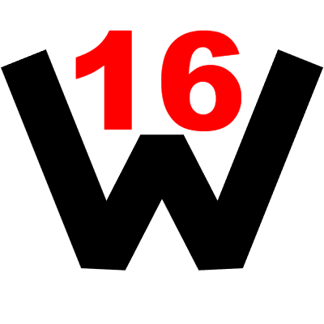

<!-- You better to read this file in review mode
     Рекомендуется читать это в режиме предпросмотра-->

  

  
  
  
  
  
  
  
  
  
  
  
  
  

# Мини-навигация ( Mini-navigation )

- `README` ( `Об проекте` ):
  - 🇺🇸 [English](README_EN.md)
  - 🇷🇺 [Русский](README_RU.md)

- `Contributing` ( `Контрибьютинг` ):
  - 🇺🇸 [English](CONTRIBUTING.md)
  - 🇷🇺 [Русский](CONTRIBUTING_RU.md)

- `License` ( `Лицензия` ):
  - 🇺🇸 [English](LICENSE)

- `Third party licenses` ( `Лицензии третьих лиц` ):
  - 🇺🇸 [English](NOTICE.html)

- `Code of conduct` ( `Code of Conduct` ):
  - 🇺🇸 [English](CODE_OF_CONDUCT.md)
  - 🇷🇺 [Русский](CODE_OF_CONDUCT_RU.md)

- `Architecture` ( `Архитектура` ):
  - 🇺🇸 [English](ARCHITECTURE.md)
  - 🇷🇺 [Русский](ARCHITECTURE_RU.md)

- `Web-documentation` ( `Веб-документация` ):
  - 🇺🇸 [English](web-docs/index.html)

## Contributors ( Контрибьюторы )
<a href="https://github.com/dev-er1/w16-project/graphs/contributors">
  
  <!-- If you see this and you're a contributor, add yourself if you'd like.
       Если вы видите это, и вы контрибьютор, добавьте себя если хотите.   -->
</a>