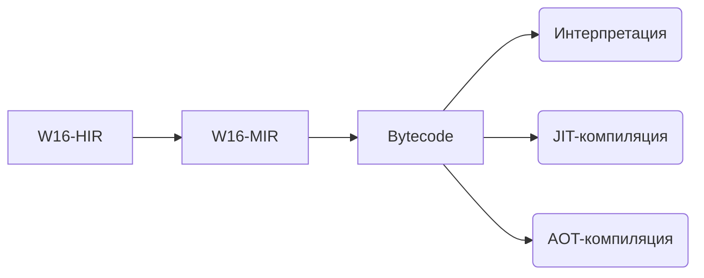

*Рекомендуется читать этот файл в режиме предпросмотра.*

  

*Скоро у меня будут экзамены, поэтому проект может не обновлятся.*

# W16
W16 — это runtime. Надеюсь всё понятно? Вы наверное ожидали гигантскую лекцию на весь файл. Нет.

## Есть ли уже языки использующие W16?
**Коротко**: пока что — <u>**нет**</u>, но активно идёт разработка:
- Разработка самого runtime-а.
- Экспериментальные языки.

---

# Немного о W16

*Бэкенд <u>ПОЛНОСТЬЮ</u> полагается на фронтенд, почти ноль семантики на уровне байт-кода.*

## Pipeline(упрощённый)

### Краткое объяснение

- **W16-HIR** — высокоуровневое представление. `W16 HIR` структурированный, типизированный, и это можно сказать как "мостик" между
фронтендом и бэкендом. Те языки которые используют `W16` как runtime, должны генерировать `W16 HIR` для выполнения кода.[Описание HIR](w16-ir\src\hir.rs)
- **W16-MIR** — среднеуровневое промежуточное представление. `W16 MIR` это **SSA IR** с оптимизациями. Почти все оптимизации
находятся в **W16 MIR**.[Описание MIR](w16-ir\src\mir.rs)

[**Подробнее о IR**](w16-ir\W16-IR.md)

- **Bytecode** — регистровый байткод, с тремя операндами и одним опкодом в структуре. Последнее во что превращается код(не считая
Cranelift IR, и машинным кодом).[Перечисление байт-кода](w16-core\src\bytecode.rs)

## Какие библиотеки используются(только внешние)

Библиотеки в **w16-core**:
  - cranelift.
  - cranelift-jit.
  - cranelift-module.
  - cranelift-native.
  - criterion.(dev-dependence).

[w16-core\Cargo.toml](w16-core\Cargo.toml)

Библиотеки в **w16-cli**:
  - target-lexicon.

[w16-cli\Cargo.toml](w16-cli\Cargo.toml)

Библиотеки в **w16c**:
  - cc.
  - cranelift.
  - cranelift-codegen.
  - cranelift-frontend.
  - cranelift-module.
  - cranelift-object.
  - target-lexicon.

[w16c\Cargo.toml](w16c\Cargo.toml)

Остальные крейты используют внутренние крейты в этом проекте / нету библиотек:
  - **w16-ir** [w16-ir\Cargo.toml](w16-ir\Cargo.toml).
  - **w16-lib** [w16-lib\Cargo.toml](w16-lib\Cargo.toml).