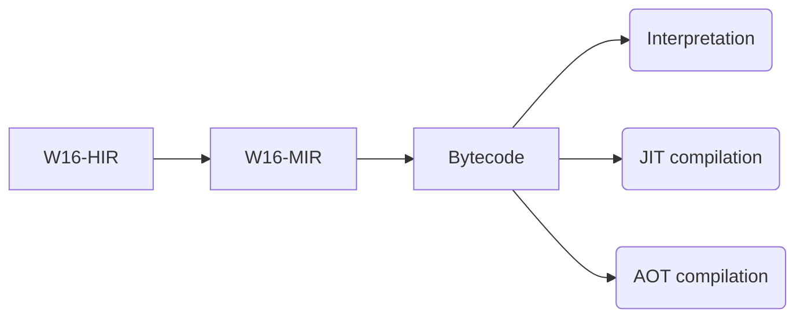

*It is recommended to view this file in preview mode.*
*This file is translate of file [README_RU.md](README_RU.md)*

  

*I will have exams soon, so the project may not be updated.*

# W16

W16 is a runtime with a multi-level IR pipeline (HIR -> MIR -> Bytecode) with support for interpretation and JIT compilation.

## Are there already languages using W16?

**Short answer**: <u>**no**</u>, but active development is ongoing:

* Development of the runtime itself.
* Experimental languages.

---

# A bit about W16

*The backend <u>FULLY</u> depends on the frontend, with almost zero semantics at the bytecode level.*

## Pipeline (simplified)

### Brief explanation

* **W16-HIR** — high-level intermediate representation. `W16 HIR` is structured, typed, and can be described as a “bridge” between the frontend and backend. Languages using `W16` as a runtime must generate `W16 HIR` to execute code. [HIR description](w16-ir\src\hir.rs)

* **W16-MIR** — mid-level intermediate representation. `W16 MIR` is an **SSA IR** with optimizations. Most optimizations are located in **W16 MIR**. [MIR description](w16-ir\src\mir.rs)

[**More about IR**](w16-ir\W16-IR.md)

* **Bytecode** — register-based bytecode with three operands and one opcode per instruction. The final form into which code is transformed (not counting Cranelift IR or machine code). [Bytecode definition](w16-core\src\bytecode.rs)

---

## External libraries used (only external dependencies)

Libraries in **w16-core**:

* cranelift
* cranelift-jit
* cranelift-module
* cranelift-native
* criterion (dev dependency)

[w16-core\Cargo.toml](w16-core\Cargo.toml)

Libraries in **w16-cli**:

* target-lexicon

[w16-cli\Cargo.toml](w16-cli\Cargo.toml)

Libraries in **w16c**:

* cc
* cranelift
* cranelift-codegen
* cranelift-frontend
* cranelift-module
* cranelift-object
* target-lexicon

[w16c\Cargo.toml](w16c\Cargo.toml)

Other crates use internal dependencies within this project / no external libraries:

* **w16-ir** [w16-ir\Cargo.toml](w16-ir\Cargo.toml)
* **w16-lib** [w16-lib\Cargo.toml](w16-lib\Cargo.toml)