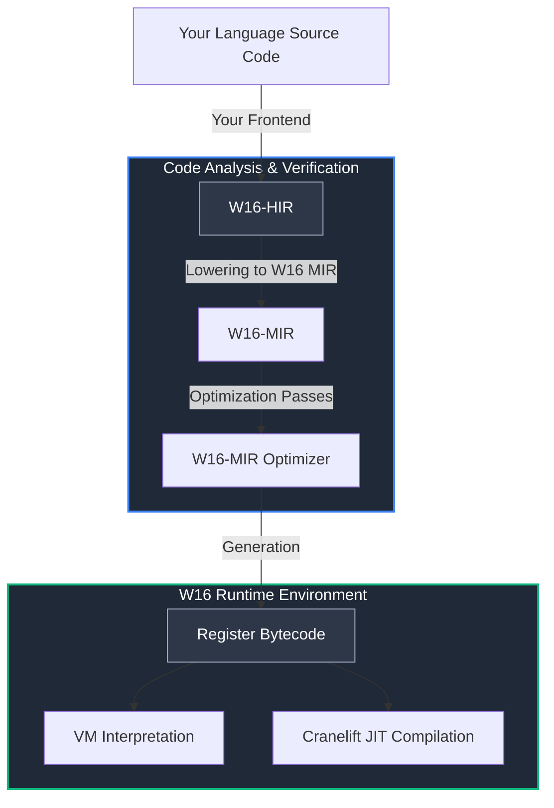

<!-- You better to read this file in review mode -->
# W16

  

  
  
  
  
  
  

  <strong>A lightweight runtime for creating modern programming languages.</strong>

---

## What is W16?

**W16** is a ready-to-use execution infrastructure (runtime) for creators of new programming languages. 
Instead of writing your own slow interpreter or spending years learning the complexities of LLVM to generate machine code, you can delegate this heavy lifting to W16.

You generate a clear high-level representation (HIR), and W16 takes care of all the dirty work:

* **Optimizations:** Multiple code optimizations take place at the **MIR** level, which is made possible by the **SSA form** of the MIR.
* **Code Execution:** Executing bytecode via either a `VM` or a `JIT compiler`, depending on your specific needs.

---

## Why W16?

Creating your own programming language is an exciting but architecturally complex process. 
Developers usually have to spend an enormous amount of time writing optimizers, machine code generators, and virtual machines.

W16 is designed to eliminate this routine and handle all the low-level work for you:

* **Clear Separation of Concerns:** You focus exclusively on the syntax, parsing, and semantics of your language. Your only task is to lower the source code into a clean high-level intermediate representation (W16-HIR). The runtime takes care of everything that happens next (optimizations, bytecode generation, and execution).
* **W16 as a Library:** You can easily add W16 as a dependency in your `Cargo.toml` and interact with the runtime via simple, straightforward functions.
* **Flexible Bytecode Execution Modes:** You can choose how your code runs. Want a quick program startup? Choose `interpretation`. Need maximum execution speed for heavy tasks? Your choice is `JIT compilation`.

## Architecture and Execution Pipeline

W16 utilizes an end-to-end multi-level code transformation pipeline. Intermediate representations (IR) are strictly isolated from each other, allowing for deep architectural optimizations at every stage before the code is transformed into low-level machine instructions.

**Pipeline Details:**

* **W16-HIR (High-level IR)** — A structured, typed representation. It preserves the program's high-level logic and serves as the main "bridge" between your frontend and the W16 backend. Languages targeting our runtime are compiled directly into this format.
* [HIR Specification and Source Code](w16-ir/src/hir.rs)

* **W16-MIR (Mid-level IR)** — A mid-level representation built on a strict **SSA (Static Single Assignment) form**. The MIR architecture is completely isolated, allowing it to perform all major optimization passes (such as Dead Code Elimination and Constant Folding) prior to machine code generation.
* [MIR Specification and Source Code](w16-ir/src/mir.rs)

* **Bytecode** — A final, compact register-based bytecode with a fixed structure (one opcode, one register, and 2 operands). This is the final transformation milestone before the code is passed to the virtual machine or the Cranelift JIT emitter.
* [Bytecode Instruction Structure](w16-core/src/bytecode.rs)

---

## Project Navigation (Crates Only)

* [w16c](w16c/README.md) — An experimental AOT compiler. It takes bytecode -> transforms it into an object file -> invokes `link.exe` from MSVC.
* [w16-core](w16-core/W16-CORE.md) — The bytecode definition and bytecode executors (interpreters/emitters).
* [w16-ir](w16-ir/W16-IR.md) — Intermediate representations (HIR/MIR) and optimization logic.
* [w16-cli](w16-cli/W16-CLI.md) — The command-line interface for W16.
* [w16-lib](w16-lib/W16-LIB.md) — The core library wrapper for embedding W16 into your projects.
* [w16-dot-lib](w16-dot-lib/README.md) — Static libraries required for AOT compilation.