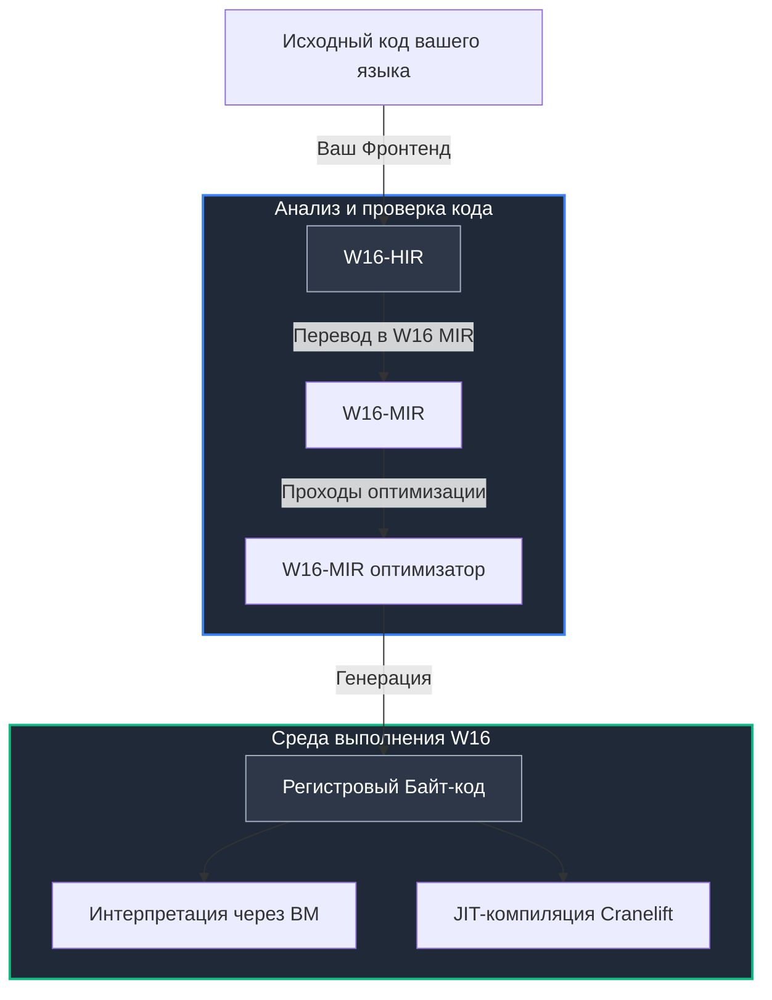

<!-- Рекомендуется читать этот файл в режиме предпросмотра -->
# W16

  

  <strong>Легковесный runtime для создания современных языков программирования.</strong>

---

> **Примечание:** В связи с грядущими экзаменами (интенсивная подготовка до 26 мая) активность разработки проекта может временно снизиться. Буду рад вашим Issues и Pull Requests!

## Что такое W16?

**W16** — это готовая инфраструктура выполнения (runtime) для авторов новых языков программирования.
Вместо того чтобы писать собственный медленный интерпретатор или годами изучать сложнейший LLVM для генерации машинного кода, вы можете делегировать эту работу W16.

Вы генерируете понятное высокоуровневое представление (HIR), а W16 берёт на себя всю грязную работу:

* **Оптимизации**. На уровне **MIR** происходят множества оптимизаций кода, что возможно из-за **SSA-формы** MIR.

* **Выполнение кода**. Выполнение байт-кода через `ВМ` или `JIT-компилятора` в зависимости от того, что вам нужно.
---

## Зачем нужен W16?

Создание своего языка программирования — это увлекательный, но архитектурно сложный процесс.
Разработчик приходится тратить колоссально много времени на написание оптимизаторов, генераторов машинного кода и виртуальных машин.

W16 создан для того, чтобы убрать эту рутину и взять всю низкоуровневую работу на себя:

* **Чёткое разделение обязанностей:** Вы фокусируетесь исключительно на синтаксисе, парсинге и семантике своего языка.
Ваша единственная задача — перевести исходный код в понятное высокоуровневое представление (W16-HIR).
Всё, что происходит дальше (оптимизации, генерация байт-кода, исполнение), рантайм берёт на себя.

* **W16 как библиотека:** Вы можете подключить W16 как зависимость в вашем `Cargo.toml`, и использовать W16 через простые
функции.

* **Режимы выполнения байт-кода:** Вы можете выбрать режим выполнения кода, хотите запустить быструю программу? Выбирайте `интерпретацию`, хотите максимальную скорость на больших задачах? Ваш выбор — `JIT-компиляция`.

## Архитектура и Pipeline выполнения

W16 использует сквозной многоуровневый пайплайн трансформации кода. Промежуточные представления (IR) изолированы друг от друга, что позволяет проводить глубокие архитектурные оптимизации на каждом этапе до того, как код превратится в низкоуровневые машинные команды.

**Детали пайплайна:**

* **W16-HIR (High-level IR)** — структурированное, типизированное представление. Оно сохраняет логику программы и служит главным "мостом" между вашим фронтендом и бэкендом W16. Языки, использующие наш рантайм, компилируются именно в этот формат.
  * [Спецификация и исходный код HIR](w16-ir/src/hir.rs)

* **W16-MIR (Mid-level IR)** — среднеуровневое представление, построенное на строгой **SSA-форме** (Static Single Assignment). Архитектура MIR изолирована, благодаря чему здесь выполняются все основные оптимизации (Dead Code Elimination, Constant Folding) до этапа генерации машинного кода.
  * [Спецификация и исходный код MIR](w16-ir/src/mir.rs)

* **Bytecode** — финальный компактный регистровый байт-код с фиксированной структурой (один опкод и три операнда). Это конечная точка трансформации кода перед передачей виртуальной машине или JIT-эмиттеру Cranelift.
  * [Структура инструкций байт-кода](w16-core/src/bytecode.rs)

---

## Навигация по проекту ( только крейты )
- [w16c](w16c/README.md) — экспериментальный AOT-компилятор. Принимает байт-код -> превращает в объектный файл -> вызывает `link.exe` из MSVC.
- [w16-core](w16-core/W16-CORE.md) — байт-код, и исполнители байт-кода.
- [w16-ir](w16-ir/W16-IR.md) — промежуточные представления.
- [w16-cli](w16-cli/W16-CLI.md) — CLI для W16.
- [w16-lib](w16-lib/W16-LIB.md) — библиотека для использования W16.
- [w16-dot-lib](w16-dot-lib/README.md) — статические библиотеки для AOT-компиляции.